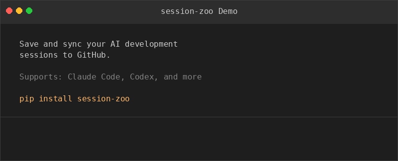

# session-zoo

[English](README.md) | [中文](README_zh.md)

Save and sync your AI development sessions to GitHub.

`session-zoo` automatically discovers sessions from AI coding tools (Claude Code, Codex, etc.), generates AI summaries, and syncs everything to a GitHub repo — raw data preserved for cross-device migration, plus readable Markdown for review.

<p align="center">
  
</p>

## Features

- **Auto-discover** sessions from `~/.claude/` (Claude Code adapter built-in)
- **AI Summarize** using existing Claude/Codex CLI (no API key needed) or Anthropic API
- **Git Sync** raw JSONL + metadata + Markdown summaries to GitHub
- **Cross-device restore** — clone on a new machine, restore sessions to `~/.claude/` for `/resume`
- **Tag & Search** sessions by project, tool, date, or custom tags
- **Extensible** adapter pattern — easy to add support for new AI tools

## Quick Start

### Install

```bash
pip install session-zoo
```

Or install from source:

```bash
git clone https://github.com/AndsGo/session-zoo.git
cd session-zoo
pip install -e .
```

### Setup

```bash
# Initialize
zoo init

# Set your GitHub repo for syncing (create an empty repo first)
zoo config set repo git@github.com:yourname/my-sessions.git
```

### Basic Workflow

```bash
# Import sessions from Claude Code
zoo import

# List all sessions
zoo list

# View session details
zoo show <session-id>
zoo show <session-id> --markdown

# Generate AI summary (uses installed claude/codex CLI automatically)
zoo summarize <session-id>

# Tag sessions for organization
zoo tag <session-id> bugfix security

# Sync everything to GitHub
zoo sync
```

### Cross-Device Restore

On a new machine:

```bash
zoo init
zoo config set repo git@github.com:yourname/my-sessions.git
zoo clone      # Clone the session repo
zoo reindex    # Rebuild local index from repo
zoo restore    # Restore .jsonl files to ~/.claude/ for /resume
```

## Commands

| Command | Description |
|---------|-------------|
| `zoo init` | Initialize configuration |
| `zoo config show/set` | View or set config (repo, ai-key, ai-model) |
| `zoo import` | Import new sessions from AI tools |
| `zoo list` | List sessions (filter by --project, --tool, --tag, --since) |
| `zoo show <id>` | Show session details (--raw, --markdown) |
| `zoo search <query>` | Search sessions by summary content |
| `zoo tag <id> [tags...]` | Add/remove tags |
| `zoo tags` | List all tags with counts |
| `zoo delete <id>` | Delete a session from index |
| `zoo summarize [id]` | Generate AI summaries (--provider auto/claude-code/codex/api) |
| `zoo sync` | Sync sessions to GitHub (--dry-run) |
| `zoo clone` | Clone session repo to local |
| `zoo reindex` | Rebuild SQLite index from repo |
| `zoo restore` | Restore session files to tool directories |

## Summarization Providers

`zoo summarize` supports multiple providers, auto-detected by priority:

1. **claude-code** — Uses installed `claude -p` CLI (no API key needed)
2. **codex** — Uses installed `codex -q` CLI (no API key needed)
3. **api** — Uses Anthropic API directly (requires `zoo config set ai-key <key>`)

```bash
# Auto-detect (uses whatever is available)
zoo summarize <id>

# Force a specific provider
zoo summarize --provider claude-code <id>
zoo summarize --provider api <id>
```

## GitHub Repo Structure

```
your-sessions-repo/
├── raw/claude-code/my-project/
│   ├── <session-id>.jsonl          # Raw session data (preserved as-is)
│   └── <session-id>.meta.json     # Metadata (tags, summary, cwd)
└── sessions/my-project/2026-03-10/claude-code/
    └── <session-id>.md            # Readable Markdown summary
```

## Adding Adapters

session-zoo uses an adapter pattern to support different AI tools. Currently supported:

- **Claude Code** (`~/.claude/projects/`)

To add a new adapter, implement `discover()`, `parse()`, and `get_restore_path()`. See [CONTRIBUTING.md](CONTRIBUTING.md) for details.

## Requirements

- Python 3.12+
- Git
- (Optional) `claude` or `codex` CLI for summarization without API key

## License

[MIT](LICENSE)
